# NewsPortal

## Table of Contents

[About](#about)
[Preview](#preview)
[Use Instructions](#use)
[Additional Information](#info)
[Licensing](#license)

## About <a name="about">
NewsPortal is a web application that collects online news articles from a variety of reputable sources and displays them all in one infinite scrolling webpage. Each article is presented as a card that displays important information such as article title, description, and publisher in a standardised format for easy reading. Each article is linked to the publisher's domain, so just click on an article to read more. Searches can be can customised by providing specific search queries and filtering the results returned.

At writing, the developer is a 2nd year university student. The purpose of creating NewsPortal was to learn the basics of handling API requests and front-end web development in a self-learning environment, as preparation for future university modules. NewsPortal was created using JavaScript, HTML, CSS and [NewsAPI](https://newsapi.org/).

## Preview <a name="preview">

#### Homepage of NewsPortal
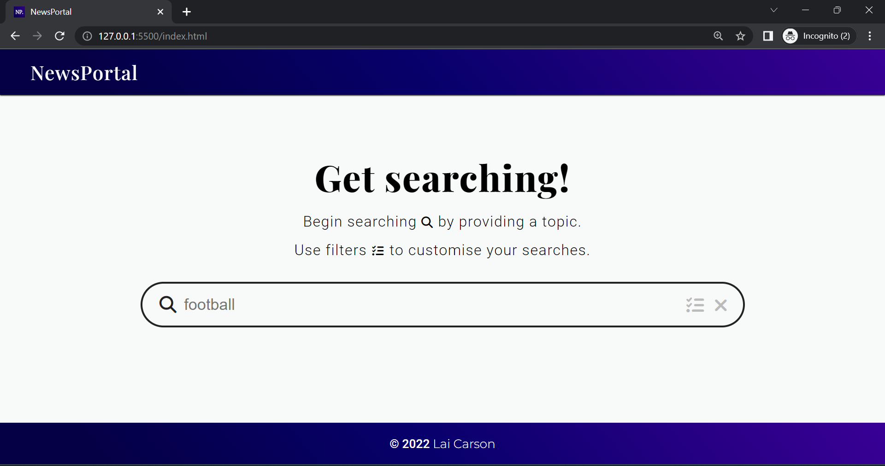

#### An example search
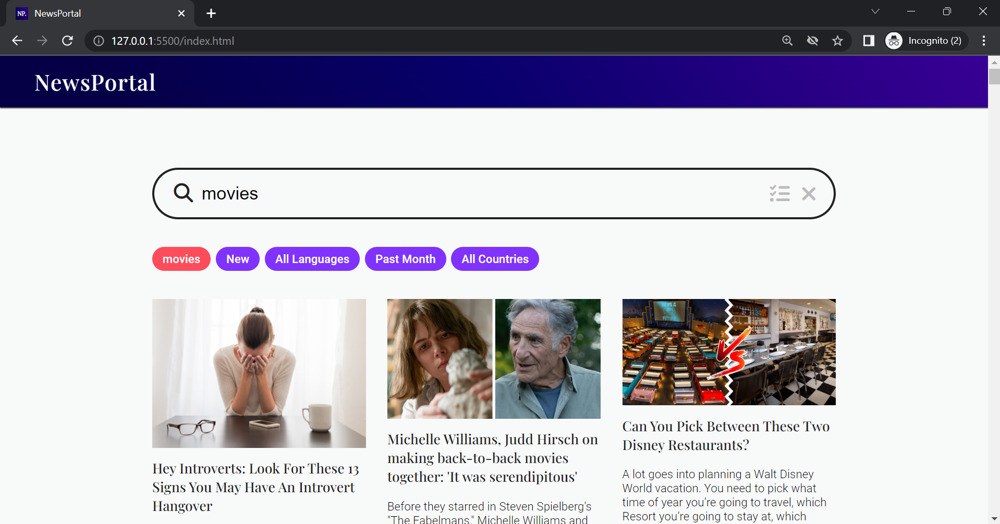

#### An example search using a different language (German shown)
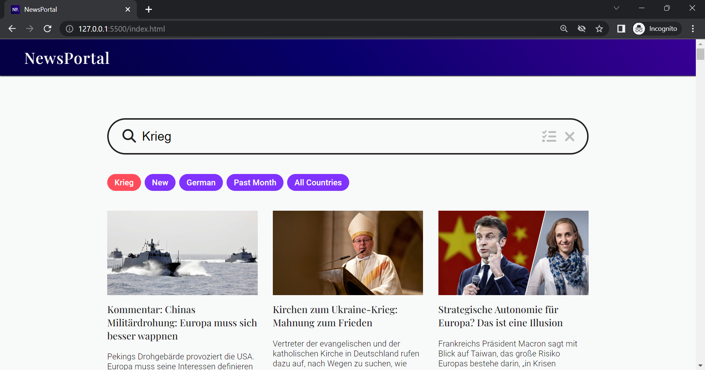

#### Filter menu
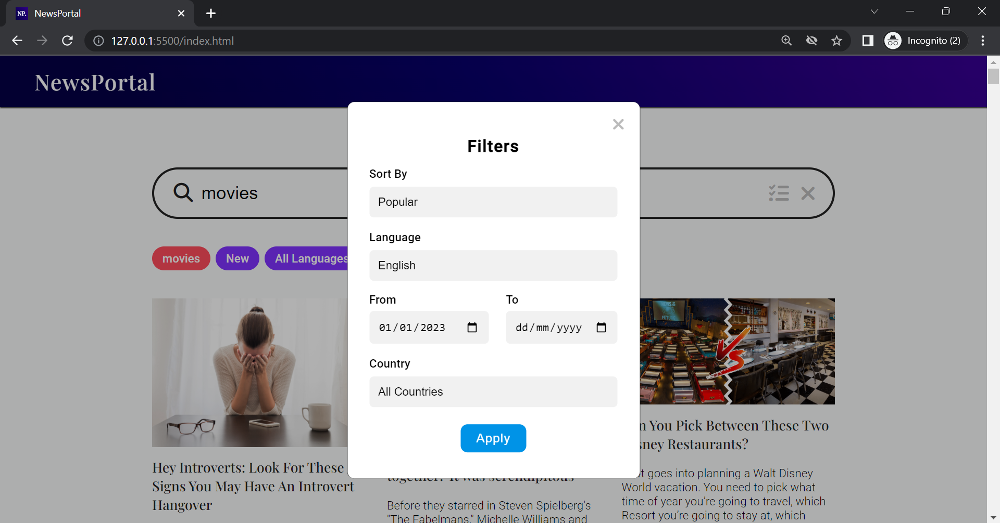

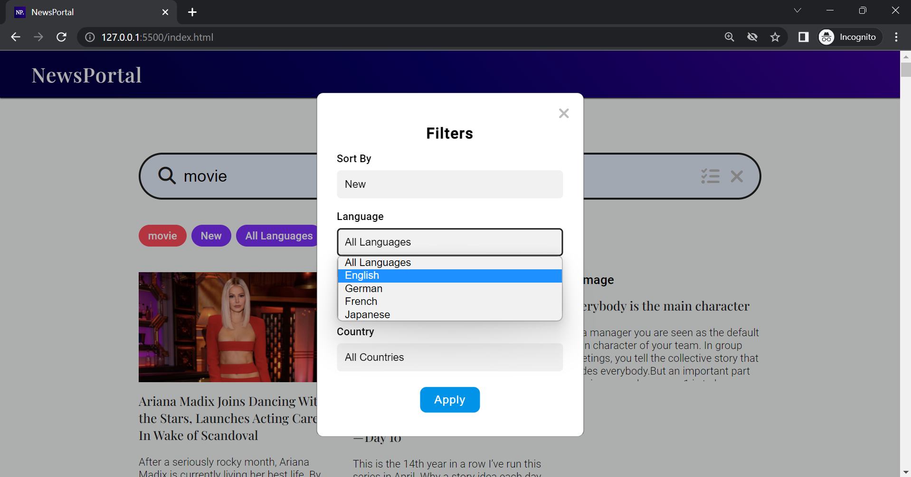

#### How articles are displayed
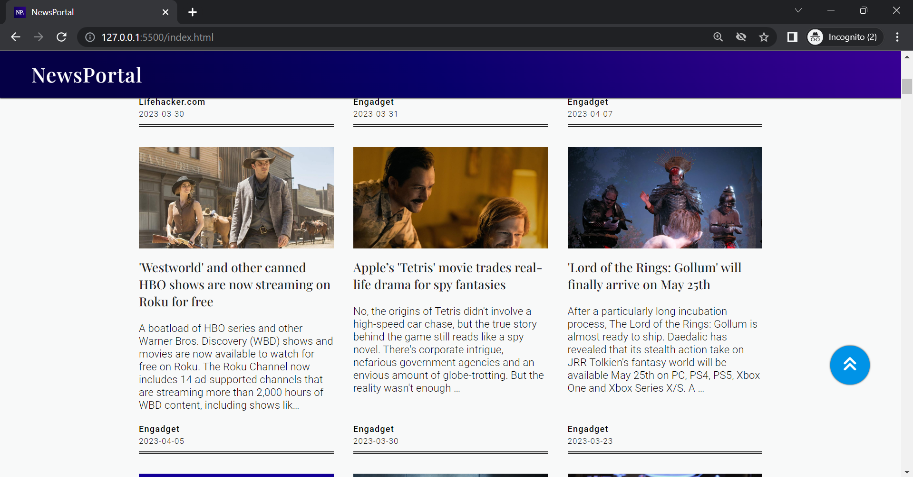

#### Hovering over an article allows user to read more

#### Click "See More" to show more articles on the same page (if available)
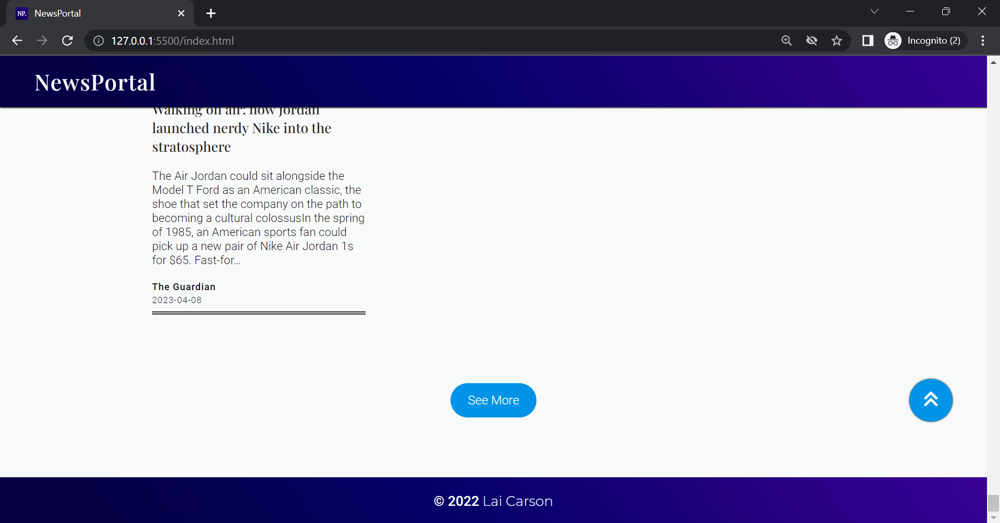

#### A successful search returns the amount of articles found
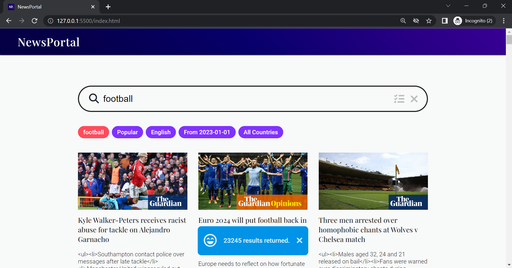

#### An unsuccessful search displays an error message
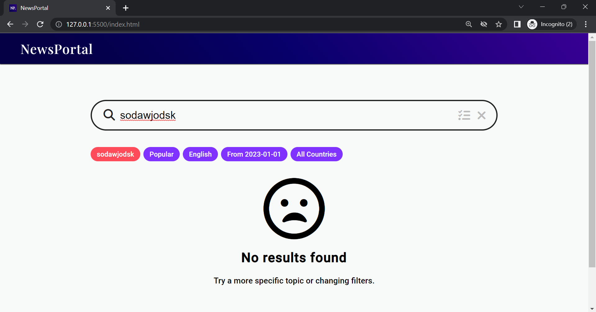

#### Previous versions of NewsPortal (previously called Content Digest)

##### Verson 1
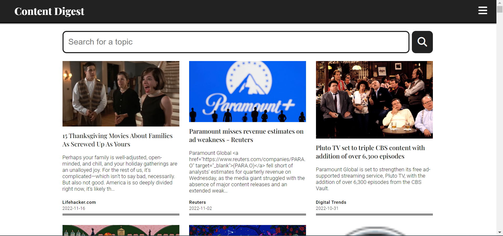

##### Version 2
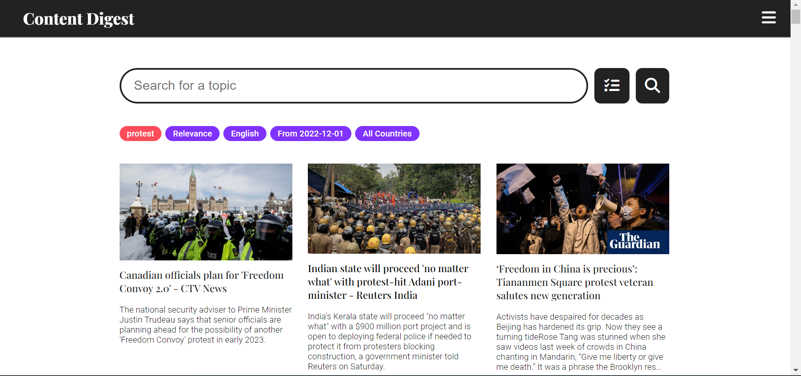

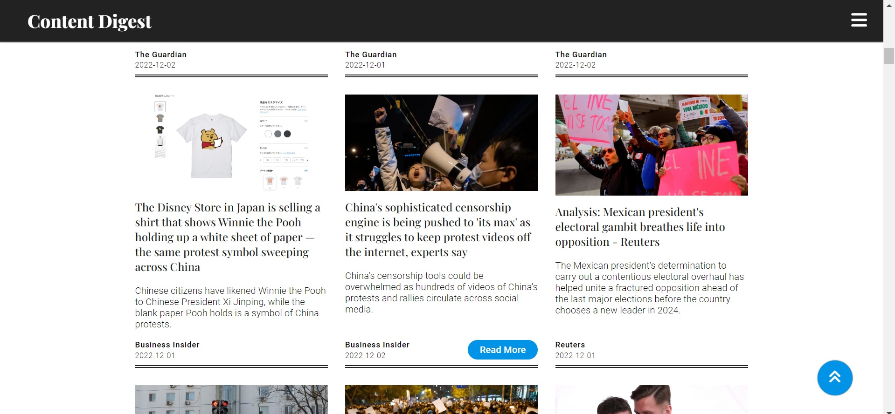

## Use Instructions <a name="use">

**IMPORTANT**: Python must be installed in your system for NewsPortal to work.

Why must I install Python? Shouldn't it already be deployed on a live server? (Click to expand)

 
Since NewsPortal is a personal project, it is not hosted on a server (which requires payment). The NewsPortal launcher requires Python to start a local HTTP server so that the application can be hosted on your local device. 
 
Note that opening index.html does not work either, since the free version of NewsAPI used in this project requires the GET requests to come from a defined localhost server. The free version of NewsAPI does not allow cross-domain requests.

#### Follow these steps carefully to start using NewsPortal:

1. Download the latest version of Python [here](https://www.python.org/downloads/) for your system.
2. Click on the downloaded file and follow the Python installation instructions.
3. At the top of [this repository page](https://github.com/carsnl/NewsPortal/), click **Code** > **Download ZIP**.
4. Unzip the downloaded file.
5. Click **launch.bat** after Python has been installed to start the application. A browser tab will be opened.
6. That's it!

## Additional Information <a name="info">

- Technology stack: JavaScript, HTML, CSS, NewsAPI (developer package)
- NewsPortal uses a personal API key. If your search does not return results after a while, the amount of requests sent to the NewsAPI servers may have exceeded the daily limit. Try again the next day.
- The limitations of NewsAPI (developer version) is listed [here](https://newsapi.org/pricing).

For enquires, contact [laicarson.swe@gmail.com](laicarson.swe@gmail.com).

## Licensing <a name="licensing">

 This work is licensed under a <a rel="license" href="http://creativecommons.org/licenses/by-nc-sa/4.0/">Creative Commons Attribution-NonCommercial-ShareAlike 4.0 International License</a>.

